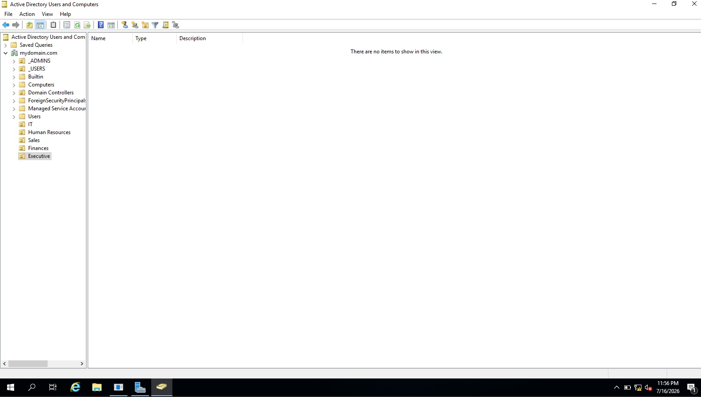
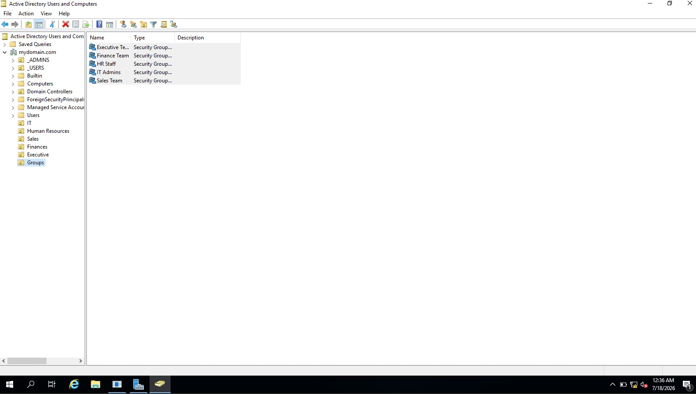
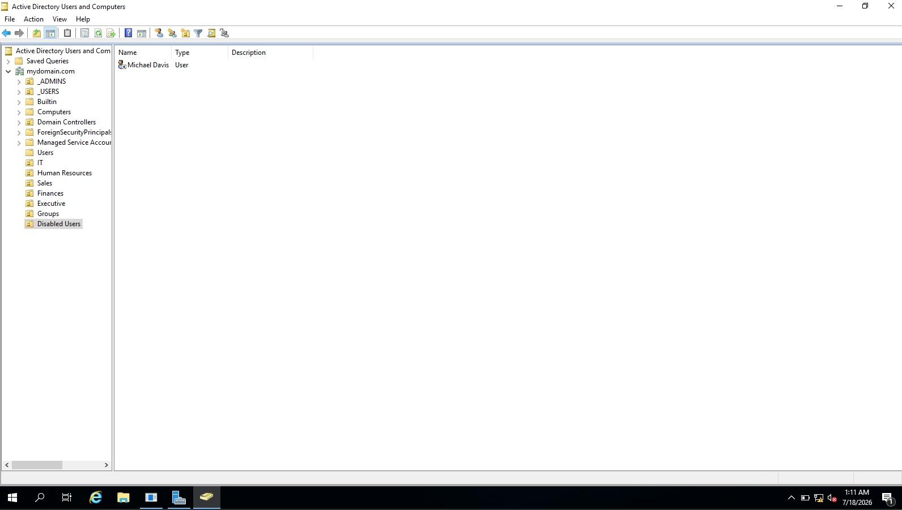
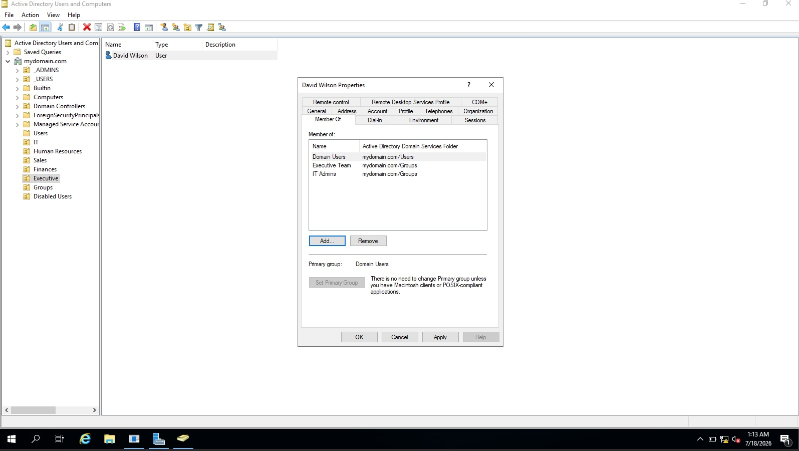
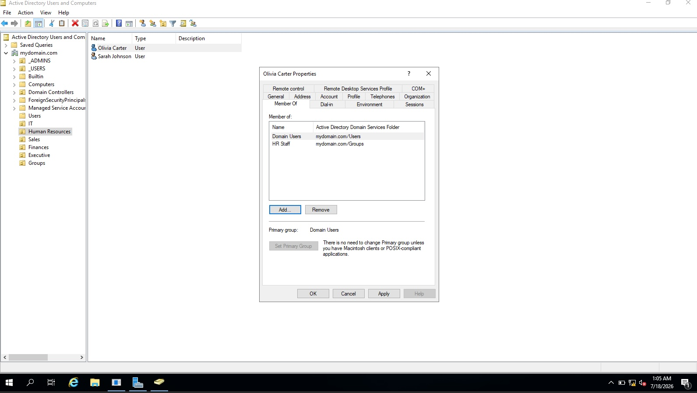
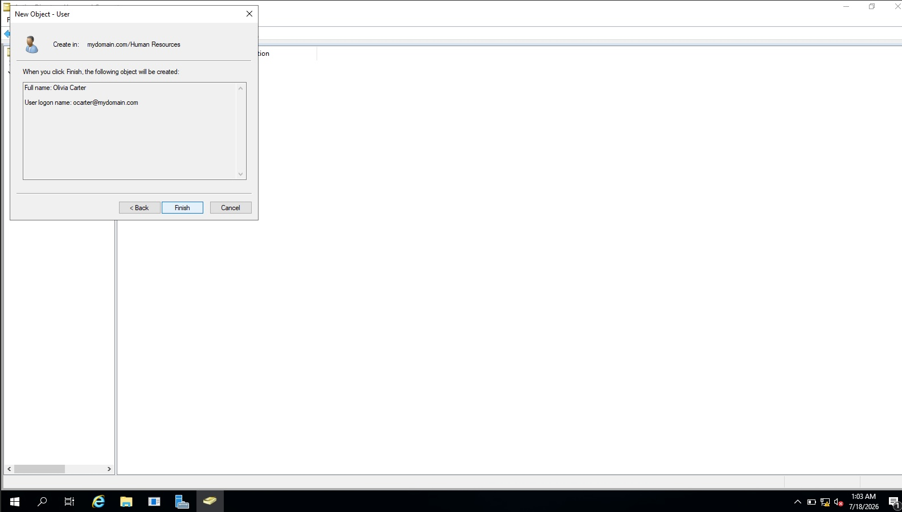
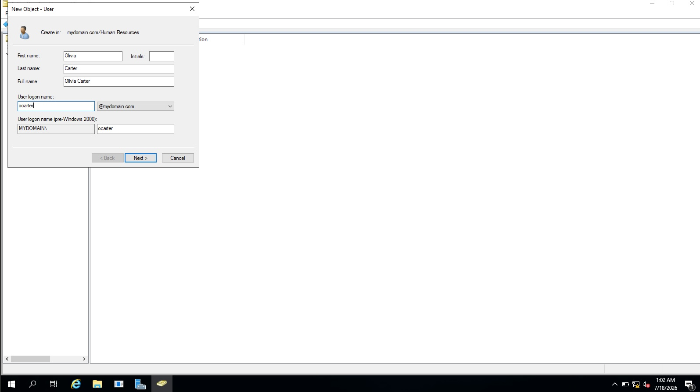
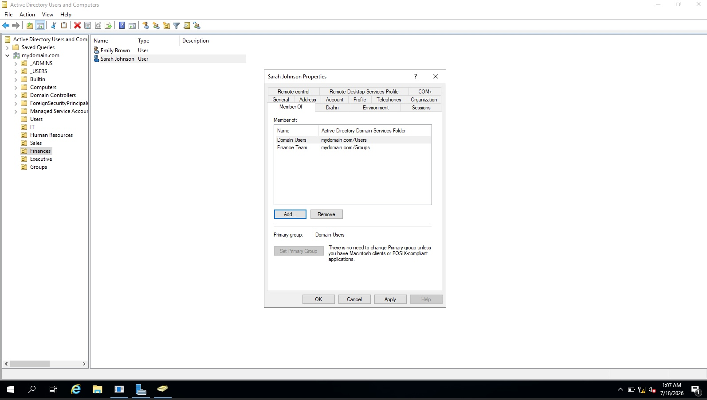
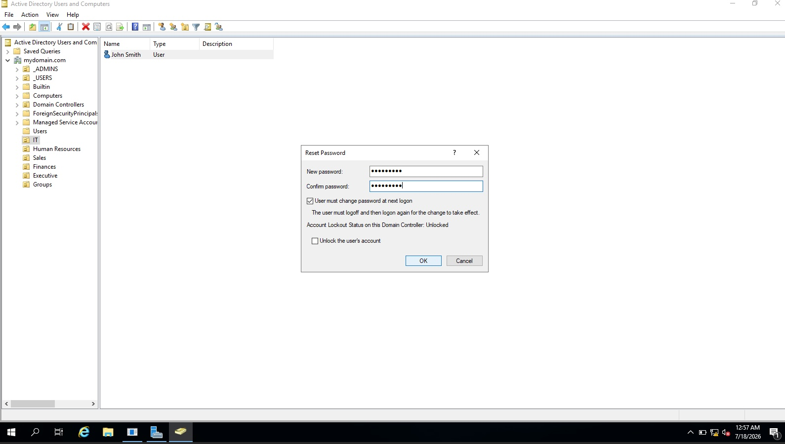
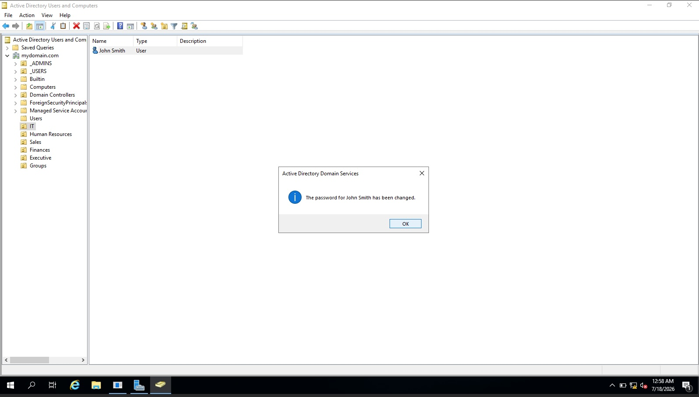

# Active Directory Home Lab

## Project Overview

This project demonstrates the deployment and administration of a Windows Server Active Directory environment using VirtualBox. The lab simulates common Help Desk and System Administration tasks including user account management, Organizational Units (OUs), security groups, password resets, and account administration.

---

## Technologies Used

- Windows Server 2019
- Active Directory Domain Services (AD DS)
- VirtualBox
- Windows 10 Client

---

## Skills Demonstrated

- Creating Organizational Units (OUs)
- Creating User Accounts
- Managing Security Groups
- Assigning Group Memberships
- Password Resets
- User Administration
- Active Directory Users and Computers (ADUC)

---

# Lab Walkthrough

## 1. Organizational Unit Structure

---

## 2. Security Groups

---

## 3. Disabled Users OU

---

## 4. Executive / IT User Group Membership

---

## 5. HR User Group Membership

---

## 6. Creating a New User

---

## 7. User Creation Confirmation

---

## 8. Finance User Group Membership

---

## 9. Password Reset

---

## 10. Password Reset Successful

---

## What I Learned

Through this lab I gained hands-on experience with:

- Active Directory administration
- User lifecycle management
- Organizational Unit design
- Security group management
- Password management
- Common Help Desk administrative tasks

